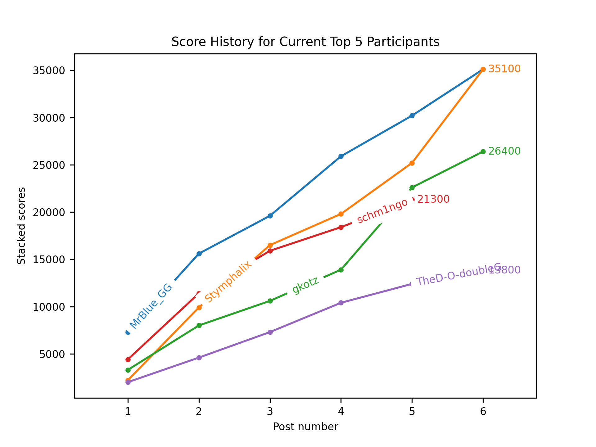

<h1 align="center">GeoStackr</h1>

  

  

A bot which posts stacked (added) scores to [/r/geoguessr](https://reddit.com/r/geoguessr) for series as specified in the `config.yaml`.

See [this post](https://www.reddit.com/r/geoguessr/comments/jcs257/3_october_streak_stacker_7/g9373r3?utm_source=share&utm_medium=web2x&context=3) for an example.

Furthermore generates fancy graphs of the progression of the top 5 participants like this:

# Running it

## Copy the `config.example.yaml` and rename it to `config.yaml`:

* Add the reddit api keys, username and password of the bot account.
* Add the series name and author in the series dict
* Set debug to `True` if you want to make a single test-run to see what it would do
* [Optional]: Add imgur API keys for the bot to add top 5 lists

## Install the requirements using pip:

`pip3 install --user -r requirements.txt`

Note that Python 3.6 is required due to f-strings

## Run it in a `tmux` or `screen` session on your server:

`python3 geostackr.py`

If `debug` is set to `False` then it will run in a while True loop every 10 minutes.
